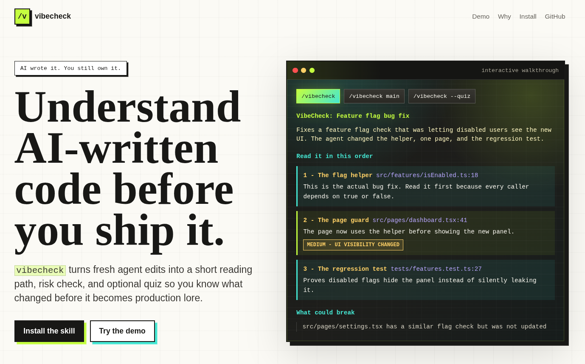

# vibecheck

> The missing handoff between AI coding agents and human understanding.



`/vibecheck` turns fresh AI-written code into a short reading path: what changed, where to start, what matters, what could break, and how to prove you actually understood it.

Use it right after Claude Code, Cursor, Windsurf, Copilot, Codex CLI, or another coding agent edits your repo.

[View landing page](./index.html) · [Read examples](./examples) · [Contribute](./CONTRIBUTING.md)

---

## Why this exists

AI coding tools can produce a 7-file feature before you have finished reading the first function. That speed is useful, but it creates a new failure mode: you merge code you technically own but do not really understand.

`vibecheck` gives you the missing review handoff. It does not replace tests, senior review, or security review. It helps you become oriented fast enough to ask better questions before the code becomes your problem in production.

---

## What you get

- **A logical reading order** instead of a raw diff dump
- **Clickable file references** so you can jump straight to the important blocks
- **Plain-English explanations** of why each change matters
- **Inline risk tags** for auth, payments, env config, data deletion, missing tests, and breaking APIs
- **"What could break" callouts** only when real callers or cross-file impact are visible
- **Quiz mode** with 3 focused questions to check whether the change actually landed in your head

---

## Example

Your agent just changed six files. You saw green checkmarks. You still do not know what it actually did.

Run:

```bash
/vibecheck
```

---

## Install

### npx — per project (recommended)

```bash
npx vibecheck-skill
```

Installs to `.agents/skills/vibecheck/SKILL.md` in your current project. Commit it to share the skill with your whole team.

### npx — global (all tools on this machine)

```bash
npx vibecheck-skill --global
```

Installs to all 6 tool-specific paths at once — Claude Code, Cursor, Windsurf, Copilot, Codex CLI, and Antigravity.

### curl — manual global install

```bash
mkdir -p ~/.agents/skills/vibecheck && \
  curl -fsSL https://raw.githubusercontent.com/bettercallsundim/vibecheck/main/SKILL.md \
  -o ~/.agents/skills/vibecheck/SKILL.md
```

Restart your AI coding tool after any install method.

No API keys. No background service. No runtime dependencies.

---

## Usage

```bash
/vibecheck                  # uncommitted changes
/vibecheck main             # current branch vs main
/vibecheck src/auth         # only a file or folder
/vibecheck --quiz           # walkthrough, then 3-question check
/vibecheck main --quiz      # branch walkthrough plus quiz
```

### When to run it

- After an AI agent edits multiple files
- Before merging a branch you mostly generated with AI
- When a diff touches auth, payments, database, jobs, env config, or permissions
- When you accepted a fix but cannot explain why it works yet

---

## How it works

`vibecheck` first looks at the active conversation. If your AI assistant just created or edited files, it uses that context directly because it already knows the intent behind the change.

If there is no useful session context, it falls back to git:

- `/vibecheck` uses local changes
- `/vibecheck main` compares your branch against `main`
- `/vibecheck path/to/file` scopes the walkthrough

Then it builds a short reading path in execution order rather than filesystem order.

---

## Quiz mode

Add `--quiz` when you want to test your understanding:

```bash
/vibecheck --quiz
```

The assistant asks 3 questions:

- One about the core change
- One about the highest-risk gotcha
- One about how the change connects to the rest of the codebase

Answers are scored inline. No long recap. The goal is comprehension, not school.

---

## Contributing

The best contributions are concrete examples of where AI-written code is easy to misunderstand.

Good first contributions:

- Add an example to [`examples/`](./examples)
- Add an eval case to [`evals/evals.json`](./evals/evals.json)
- Improve a risk rule in [`SKILL.md`](./SKILL.md)
- Report a walkthrough that was too vague, too long, or missed a real risk

Read [`CONTRIBUTING.md`](./CONTRIBUTING.md) before opening a PR.

---

## License

MIT
